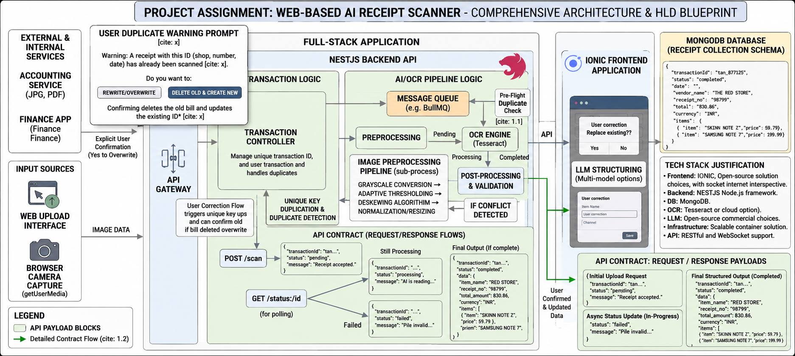

# HLD.md — AI Receipt Scanner System

````md
# High Level Design (HLD)
# AI-Based Receipt Scanner System

## 1. Project Overview

The AI Receipt Scanner is a web-based application designed to extract, process, validate, and structure receipt information from uploaded receipt images or PDFs.

The system allows users to:
- Upload receipt images/PDFs
- Extract receipt text using OCR
- Structure extracted data using AI/LLM
- Detect duplicate receipts
- Validate and correct extracted information
- Store structured receipt data in MongoDB

The application is built using:
- Frontend: Ionic
- Backend: NestJS
- OCR Engine: Tesseract OCR
- AI Model: Llama 3.1
- Database: MongoDB

---

# 2. Objectives

The primary objectives of the system are:

- Automate receipt digitization
- Reduce manual accounting effort
- Provide structured financial records
- Improve receipt extraction accuracy
- Support duplicate receipt detection
- Allow user corrections before final storage

---

# 3. System Architecture Overview

The system follows a modular full-stack architecture:

Frontend (Ionic)
        ↓
API Gateway
        ↓
NestJS Backend
        ↓
OCR + AI Processing Pipeline
        ↓
MongoDB Storage

The architecture is divided into:
- Presentation Layer
- API Layer
- Business Logic Layer
- OCR & AI Processing Layer
- Data Storage Layer

---

# 4. Technology Stack

| Layer | Technology |
|---|---|
| Frontend | Ionic |
| Backend | NestJS |
| OCR Engine | Tesseract OCR |
| AI/LLM | Llama 3.1 |
| Database | MongoDB |
| Queue System | BullMQ |
| File Handling | Multer |
| API Type | REST API |
| Containerization | Docker |

---

# 5. Architecture Components

## 5.1 Ionic Frontend

The frontend application provides:
- Receipt upload interface
- Camera capture support
- Receipt preview
- Duplicate warning prompts
- OCR result display
- User correction interface
- Status polling

### Responsibilities
- Upload image/PDF
- Display processing states
- Handle user confirmation
- Display structured receipt data

---

## 5.2 API Gateway

The API Gateway acts as the entry point for frontend requests.

### Responsibilities
- Route incoming requests
- Validate requests
- Forward requests to backend services
- Return API responses

---

## 5.3 NestJS Backend

The backend handles:
- Receipt processing workflow
- Duplicate detection
- OCR orchestration
- AI integration
- Validation logic
- Database communication

### Main Modules
- Upload Module
- OCR Module
- AI Structuring Module
- Duplicate Detection Module
- Transaction Module
- Receipt Validation Module

---

## 5.4 OCR Processing Pipeline

The OCR pipeline extracts raw text from uploaded receipts.

### OCR Engine
- Tesseract OCR

### OCR Workflow
1. Image upload
2. Image preprocessing
3. OCR extraction
4. Raw text generation

### Image Preprocessing Steps
- Grayscale conversion
- Adaptive thresholding
- Noise reduction
- Resizing/normalization

---

# 6. AI Structuring Layer

After OCR extraction, the raw text is passed to Llama 3.1 for intelligent data structuring.

### AI Responsibilities
- Extract vendor name
- Detect receipt number
- Extract date
- Extract total amount
- Identify currency
- Extract line items
- Validate OCR inconsistencies

### Example Structured Output

```json
{
  "vendor_name": "RED STORE",
  "receipt_no": "98799",
  "total_amount": 830.86,
  "currency": "INR",
  "items": [
    {
      "item": "SKINN NOTE Z",
      "price": 59.79
    }
  ]
}
````

---

# 7. Duplicate Detection System

The system prevents duplicate receipt storage.

### Duplicate Detection Keys

* Vendor name
* Receipt number
* Date
* Total amount

### Workflow

1. Receipt uploaded
2. Unique key generated
3. Database lookup performed
4. User warned if duplicate exists
5. User decides:

   * overwrite existing
   * create new

---

# 8. Database Design

## MongoDB Receipt Collection

```json
{
  "transactionId": "txn_87125",
  "status": "completed",
  "date": "2025-08-01",
  "vendor_name": "RED STORE",
  "receipt_no": "98799",
  "total_amount": 830.86,
  "currency": "INR",
  "items": [
    {
      "item": "SKINN NOTE Z",
      "price": 59.79
    }
  ]
}
```

---

# 9. API Design

## POST /scan

Uploads receipt image.

### Request

* multipart/form-data

### Response

```json
{
  "transactionId": "txn_001",
  "status": "pending",
  "message": "Receipt accepted."
}
```

---

## GET /status/:id

Fetches processing status.

### Possible Responses

Processing:

```json
{
  "status": "processing"
}
```

Completed:

```json
{
  "status": "completed",
  "data": {}
}
```

Failed:

```json
{
  "status": "failed",
  "message": "Invalid receipt."
}
```

---

# 10. Queue-Based Processing

BullMQ is used for asynchronous receipt processing.

### Benefits

* Non-blocking uploads
* Better scalability
* Retry handling
* Background OCR execution

### Queue Flow

Upload → Queue → OCR → AI Structuring → Validation → Database

---

# 11. Trade-Off Analysis

## OCR Technology Comparison

| Feature             | Tesseract OCR | Google Cloud Vision API | Multimodal AI Models |
| ------------------- | ------------- | ----------------------- | -------------------- |
| Cost                | Free          | Paid API                | High                 |
| Accuracy            | Medium        | High                    | Very High            |
| Offline Support     | Yes           | No                      | Depends              |
| Privacy             | High          | Medium                  | Medium               |
| Latency             | Medium        | Fast                    | Slow                 |
| Infrastructure Need | Low           | Low                     | High                 |
| Customization       | High          | Limited                 | High                 |

---

## Final Technology Decision

### Why Tesseract OCR Was Chosen

Tesseract OCR was selected because:

* Open-source and free
* No recurring API cost
* Supports local processing
* Better data privacy
* Easier MVP deployment

### Why Llama 3.1 Was Chosen

Llama 3.1 was selected because:

* Strong text understanding
* Good structured extraction capability
* Open-source deployment flexibility
* Lower operational cost compared to commercial LLM APIs

---

# 12. Scalability Considerations

The architecture supports scalability through:

* Queue-based processing
* Modular backend services
* Containerized deployment
* Stateless API servers

Future scaling options:

* Kubernetes deployment
* Distributed queue workers
* OCR microservices
* GPU-based AI inference

---

# 13. Security Considerations

Security measures include:

* File type validation
* File size restrictions
* API validation
* Secure database access
* Environment variable protection
* HTTPS communication

---

# 14. Error Handling

The system handles:

* Invalid image uploads
* OCR failures
* AI extraction failures
* Duplicate receipts
* Queue processing failures

Retry mechanisms are implemented using BullMQ.

---

# 15. Future Enhancements

Future improvements may include:

* Multi-language OCR
* Cloud Vision fallback
* Real-time websocket updates
* Receipt categorization
* Expense analytics dashboard
* Mobile application support
* Fine-tuned receipt extraction models

---

# 16. Conclusion

The AI Receipt Scanner system provides a scalable and modular architecture for intelligent receipt digitization.

By combining:

* Tesseract OCR
* Llama 3.1
* NestJS
* Ionic
* MongoDB

the system achieves:

* low operational cost
* privacy-focused processing
* structured receipt extraction
* scalable asynchronous processing

while maintaining flexibility for future AI and OCR improvements.

```
```
# 3. System Architecture Overview

The system follows a modular architecture using Ionic, NestJS, Tesseract OCR, and Llama 3.1.

## System Architecture Diagram


